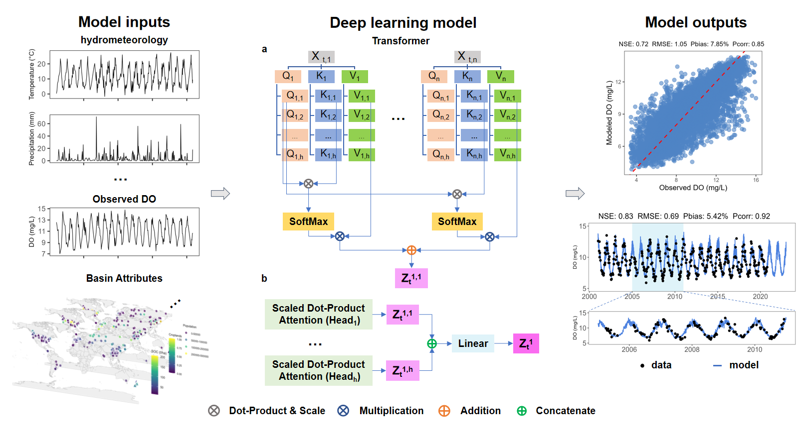

# Coupling Deep Learning and Google Earth Engine for Global Daily River Dissolved Oxygen Reconstruction

This project presents a transformer-based deep learning framework to reconstruct daily dissolved oxygen (DO) concentrations in rivers at a global scale by integrating hydrometeorological datasets and watershed attributes. The study addresses the challenges of spatiotemporal gaps in water quality records and provides new insights into the key drivers of DO dynamics worldwide.

## Highlights

- Developed a global-scale transformer model for daily river dissolved oxygen reconstruction.
- Integrated hydrometeorological data and basin characteristics for robust predictions.
- Achieved a Nash–Sutcliffe Efficiency (NSE) of 0.72 over 403 global river stations.
- Identified 30-day cumulative air temperature as the primary driver of DO dynamics.

## Main Features

- Handling sparse water quality data and large data gaps.
- All input variables are derived from datasets with global coverage.
- Model interpretability for input importance.

## File Descriptions

- **DO_benchmark.py**  
  Benchmark model script for comparing the performance of different models on the dataset.

- **DO_benchmark_test.py**  
  Testing script for the benchmark model, used to evaluate performance on the test set.

- **DOformer.py**  
  Main script defining and training the DOformer model.

- **DOformerTest.py**  
  Testing script for the DOformer model, evaluating its performance on the test set.

- **DOformerVal.py**  
  Validation script for the DOformer model, used for hyperparameter tuning and validation.

- **DOformer_optuna.py**  
  Script for hyperparameter optimization of the DOformer model using Optuna.

- **Google Earth Engine Data Extraction Code.txt**  
  Code for extracting data from Google Earth Engine (GEE).

- **feature_importance_results.csv & global_delta.csv**  
  Results of the feature importance analysis.

- **model_optuna.py**  
  Script for hyperparameter optimization of a general model using Optuna.

- **requirements.txt**  
  Python environment dependency list for installing the required packages.

- **test_predictions.csv**  
  Model predictions on the test set.

## Contact

Jianrong Ma  
Chongqing Institute of Green and Intelligent Technology,  
Chinese Academy of Sciences, Chongqing, 400714, China  
E-mail: majianrong@cigit.ac.cn

---
